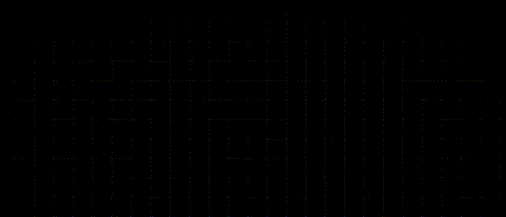

    

# Hacktoberfest 2023 Repository

Welcome to the Hacktoberfest 2023 repository! This is a place for everyone who wants to participate in Hacktoberfest 2023. You can contribute by adding quality code or projects to this repository and earn yourself some cool swag, like a T-Shirt, while making a positive impact.

## What is Hacktoberfest?

[Hacktoberfest](https://hacktoberfest.com/) is an annual event that celebrates open source software and encourages people to contribute to open source projects. By participating in Hacktoberfest, you can make meaningful contributions to the open source community and get rewarded with awesome swag.

## How to Contribute

Contributing to this repository is easy. Here's how you can get started:

1. **Fork this repository.**
2. **Create a new branch for your contribution.**
3. **Add your code or project to the repository.**
4. **Submit a pull request with your changes.**

**To learn more about Hacktoberfest, please visit:** [Hacktoberfest website](https://hacktoberfest.com/)

## Collaborators

[]